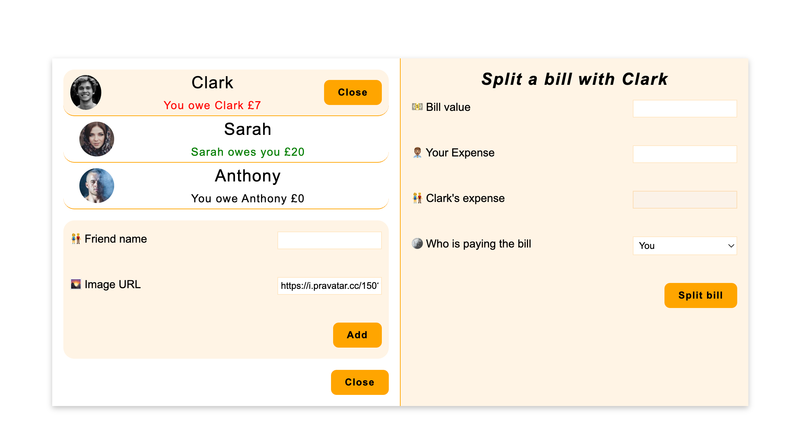

# Bill Splitter App



A React-based application for splitting bills between friends and tracking who owes what. Perfect for group dinners, shared expenses, and keeping track of debts among friends.

## Features

- **Friend Management**: Add and manage friends with profile pictures
- **Bill Splitting**: Split bills between you and any friend with automatic calculations
- **Expense Tracking**: Keep track of who owes money to whom
- **Visual Indicators**: Color-coded amounts (green for money owed to you, red for money you owe)
- **Responsive Design**: Works on desktop and mobile devices
- **Interactive UI**: Click to select friends, easy bill splitting interface

## Getting Started

1. Clone the repository

```bash
git clone [repository-url]
cd bill-splitter-app
```

2. Install dependencies

```bash
npm install
```

3. Start the development server

```bash
npm run dev
```

### Adding Friends

1. Click the "Add friend" button
2. Enter your friend's name
3. Optionally provide a custom image URL (random avatar generated if empty)
4. Click "Add" to save the friend

### Splitting Bills

1. Click on a friend from the friends list to select them
2. Enter the total bill amount
3. Enter your portion of the expense
4. Friend's portion is automatically calculated
5. Choose who paid the bill (you or your friend)
6. Click "Split bill" to record the transaction

### Understanding Balances

- **Green text**: Your friend owes you money
- **Red text**: You owe your friend money
- **No color**: You're even (£0 balance)

## Project Structure

```
src/
├── App.jsx                 # Main application component
├── components/
│   ├── BillSplitter/
│   │   ├── BillSplitter.jsx    # Bill splitting logic and UI
│   │   └── billSplitter.css    # Styles for bill splitter
│   ├── Friends/
│   │   ├── Friends.jsx         # Friends list container
│   │   ├── Friend.jsx          # Individual friend component
│   │   ├── AddFriend.jsx       # Add friend form
│   │   └── friend.css          # Styles for friends components
│   ├── Button.jsx              # Reusable button component
│   └── InputGroup.jsx          # Form input group wrapper
```

## Technologies Used

- **React JS**
- **CSS3**
- **Pravatar.cc** for random avatar generation

## Features in Detail

### Calculation Logic

- **If you paid the bill**: Friend's expense amount is added to their debt to you
- **If friend paid the bill**: Your expense amount is subtracted from what they owe you
